###Intro to the Command Line

Quit Whining and Shell!

Steven King and Caleb Smith

J583 Adv. Interactive Multimedia Programing

@@

###How to Shell

Type Everything I do

Memorize the Commands

Commit!

@@

###Open Terminal

Type something

Do it again

And again

@@

###First Commands

pwd

hostname

cd

ls

mkdir

rmdir

cp

mv

less

cat

@@

###Paths, Folders, Directories (pwd)

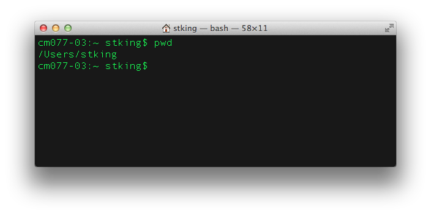

@@

###What’s Your Computer’s Name? (hostname)

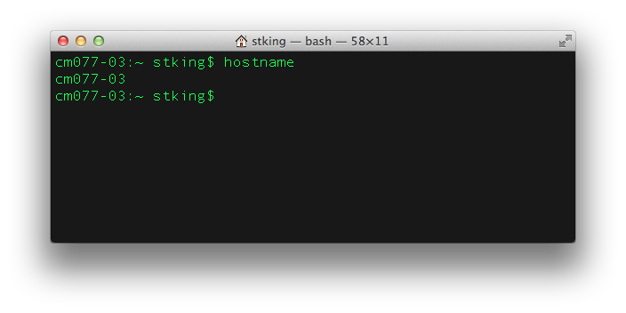

@@

###Learn how to Transverse “The Tree”

Create folders, move files, etc.

@@

###List (ls)

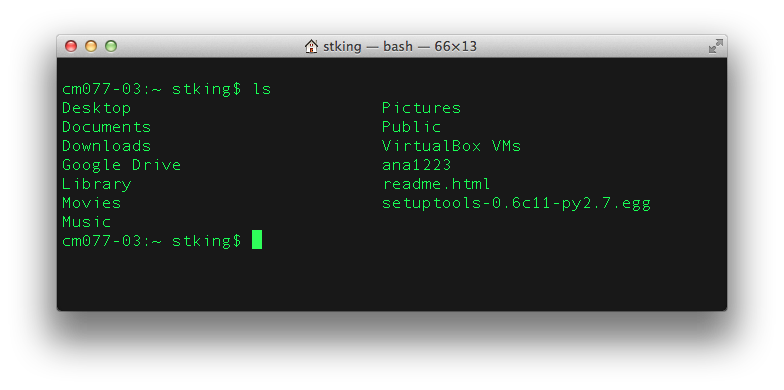

@@

###Change Directory (cd)

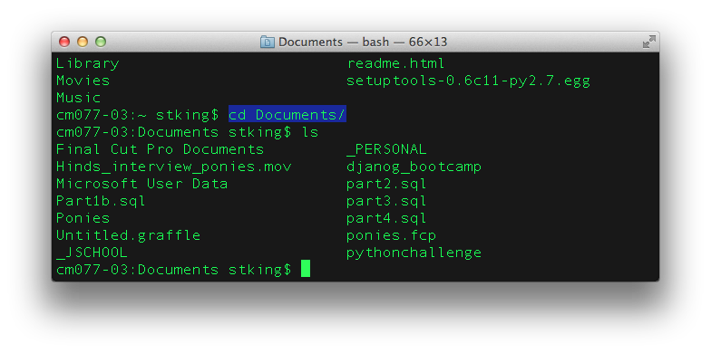

@@

###Make Directory (Folder)

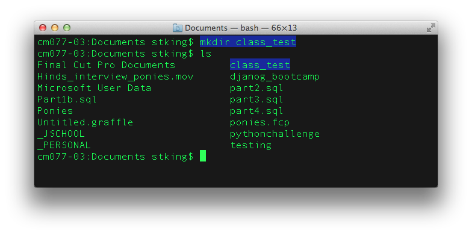

@@

###mkdir more

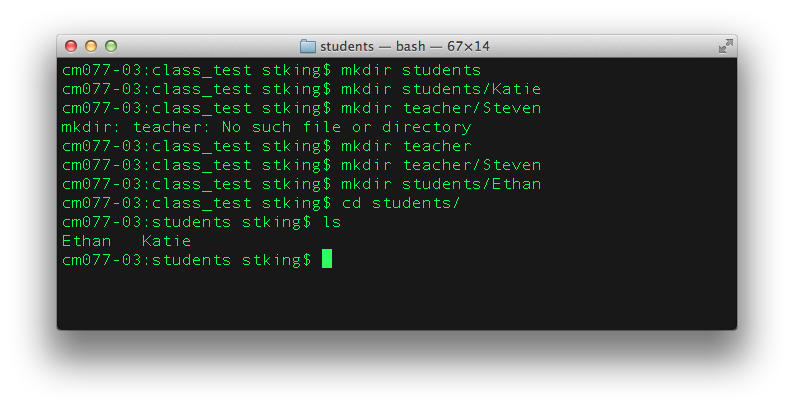

@@

###mkdir with spaces

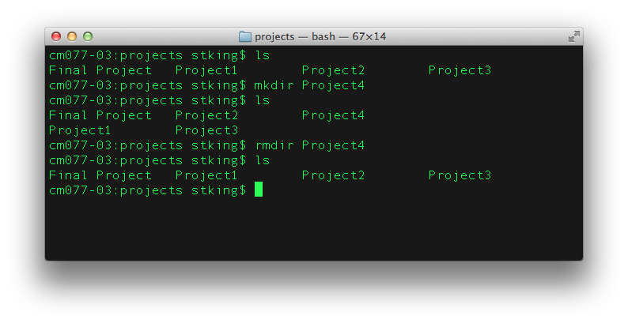

@@

###Remove Directory (rmdir)

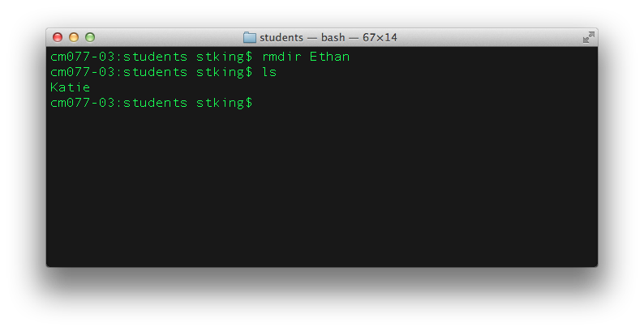

@@

###rmdir and contents

rmdir – rf directory

Don’t do this:

rm –r *

@@

###Now lets try it: cd, ls, mkdir, rmdir

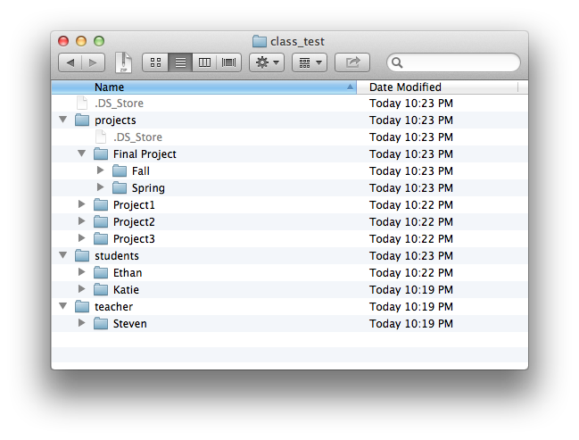

In Class Exercise:

Create this directory structure using the commands you just learned.

Call me over when finished.

Hint: Pay attention to upper/lower case.

@@

###Copy (cp) From Space To

@@

###Move (mv)  From Space To

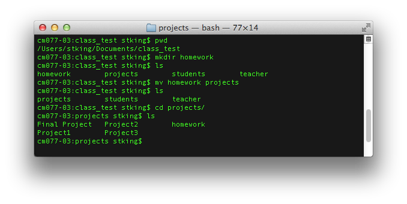

@@

###Create/Update File (touch)

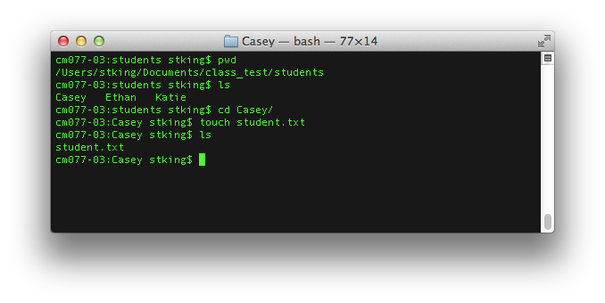

@@

###Edit File (VI basics)

vi is a text editor in Terminal

i

 to Insert

Escape to get out of Insert

hjkl

 Left, Down, Up Right

:w to write

:q to quit

:wq!
To do both at the same time.

@@

###vi

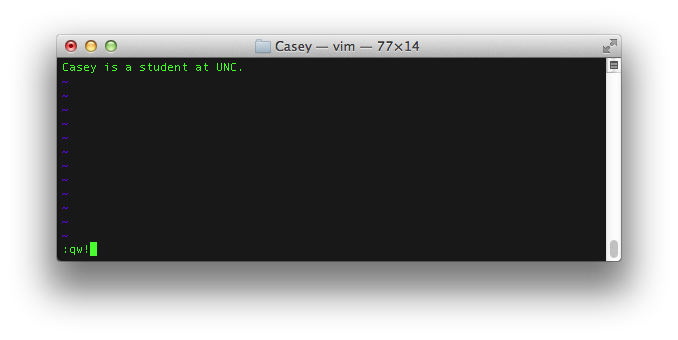

@@

###View A File (cat or less)

Cat view a file

Less view file paged (for big files)

@@

###Cat

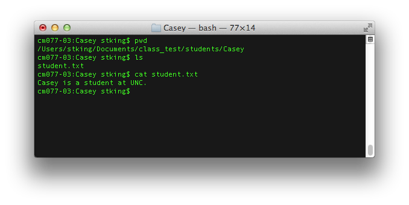

@@

###Questions

Questions, Comments, Fears

@@

###Assignment 1

Perform each of these commands 20 times. Saying the command each time.

Copy Files, Move

Dirs

, Delete

Dirs

Save or Export the text of the entire script as

LastName_First

.

Don’t worry about your mistakes. Know  you will make many of them

Email me with subject line J583 Assignment 1

@@

###For Wednesday

Turn in assignment 1 before class

Quiz on commands covered so far.
